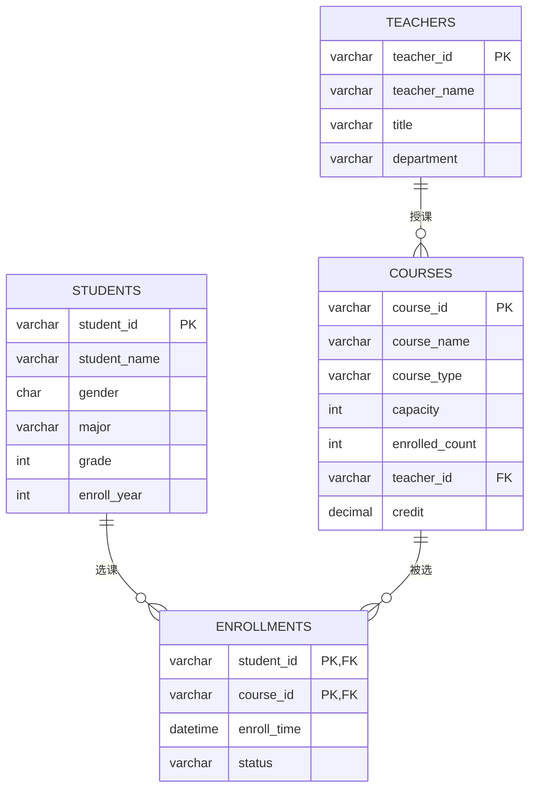

# 第四题：分析及设计

基于前两题的功能，聚焦三点做核心数据架构设计：核心数据模型（含 ER 图）、并发风险、索引设计。

---

## 1. 核心数据模型

在学生表、课程表、选课记录表基础上，补充**教师表（teachers）**，并完善各表字段。

### 1.1 表字段设计

#### 学生表 students
| 字段 | 类型 | 说明 |
|------|------|------|
| student_id | VARCHAR(20) | 学生ID，主键，格式 S+6位数字 |
| student_name | VARCHAR(50) | 姓名 |
| gender | CHAR(1) | 性别（M/F） |
| major | VARCHAR(50) | 专业 |
| grade | INT | 年级 |
| enroll_year | INT | 入学年份 |

#### 教师表 teachers（新增）
| 字段 | 类型 | 说明 |
|------|------|------|
| teacher_id | VARCHAR(20) | 教师ID，主键，格式 T+6位数字 |
| teacher_name | VARCHAR(50) | 姓名 |
| title | VARCHAR(20) | 职称（教授/副教授/讲师） |
| department | VARCHAR(50) | 所属院系 |

#### 课程表 courses
| 字段 | 类型 | 说明 |
|------|------|------|
| course_id | VARCHAR(20) | 课程ID，主键，格式 C+6位数字 |
| course_name | VARCHAR(50) | 课程名称 |
| course_type | VARCHAR(20) | 课程类型（公共课/专业课/选修课） |
| capacity | INT | 课程容量 |
| enrolled_count | INT | 已选人数（冗余字段，用于并发扣减，见第 2 节） |
| teacher_id | VARCHAR(20) | 授课教师ID，外键 → teachers |
| credit | DECIMAL(3,1) | 学分 |

#### 选课记录表 enrollments
| 字段 | 类型 | 说明 |
|------|------|------|
| student_id | VARCHAR(20) | 学生ID，联合主键，外键 → students |
| course_id | VARCHAR(20) | 课程ID，联合主键，外键 → courses |
| enroll_time | DATETIME | 选课时间 |
| status | VARCHAR(10) | 选课状态（已选/已退） |

> **联合主键 (student_id, course_id)** 从数据库层面天然保证"同一学生不能重复选同一门课"，这正是第一题"去重规则"在持久层的落地。

### 1.2 表间关联关系

- **students 1 : N enrollments**：一个学生可有多条选课记录。
- **courses 1 : N enrollments**：一门课程可被多名学生选。
- **students M : N courses**：通过 enrollments 中间表实现多对多。
- **teachers 1 : N courses**：一位教师可教授多门课程。

### 1.3 ER 图



> 上述为 Mermaid ER 图，GitHub 可直接渲染。文字版关系：
> `TEACHERS 1—N COURSES`，`STUDENTS M—N COURSES`（经 `ENROLLMENTS` 中间表）。

---

## 2. 并发风险

### 2.1 核心并发问题：选课高峰期的"超卖"
选课开放瞬间大量学生抢同一门热门课。典型时序：

1. 课程剩余容量 = 1；
2. 学生 A、B 几乎同时读到"剩余 1，可选"；
3. 两者都通过校验并写入选课记录；
4. 结果实际选课人数 **超过 capacity**（超卖）。

本质是"检查容量"与"写入记录"两步操作非原子，存在竞态条件（read-modify-write 竞争）。

### 2.2 解决方案：数据库乐观锁（单条 UPDATE 原子扣减）

在 `courses` 表用 `enrolled_count` 计数，把"判断 + 扣减"合并为**一条带条件的原子 UPDATE**：

```sql
-- 1. 原子地占用一个名额：仅当未满时才 +1，依赖行锁保证原子性
UPDATE courses
SET enrolled_count = enrolled_count + 1
WHERE course_id = #{courseId}
  AND enrolled_count < capacity;

-- 2. 判断受影响行数：
--    affectedRows == 1 -> 抢到名额，再插入 enrollments（联合主键防重复选课）
--    affectedRows == 0 -> 课程已满，返回"选课失败：名额已满"
```

**为什么可行（贴合简单可落地）：**
- `WHERE enrolled_count < capacity` 把容量判断放进 UPDATE 条件，数据库行级锁保证同一行串行执行，杜绝超卖；
- 无需引入分布式锁/消息队列等重型组件，单库即可实现，适合中小规模选课系统；
- 配合 `enrollments` 的联合主键 `(student_id, course_id)`，重复选课会触发主键冲突直接被拒，双重保障。

> 若并发量进一步增大，可升级为 Redis 预扣库存 + 消息队列削峰，但此处按题目"简单可行"给出数据库乐观锁方案。

---

## 3. 索引设计

### 3.1 选课记录表 enrollments

| 索引 | 字段 | 类型 | 设计理由 |
|------|------|------|----------|
| 主键索引 | (student_id, course_id) | 聚簇/唯一 | 联合主键，保证唯一性（防重复选课），并加速按学生查选课 |
| 二级索引 | (course_id) | 普通 B+Tree | "统计每门课选课人数""按课程查选课名单"高频，联合主键左前缀是 student_id 无法服务这类查询，需单独建 |
| 二级索引 | (enroll_time) | 普通 B+Tree | 按选课时间范围统计/排序（如分析选课高峰时段） |

> 联合主键 `(student_id, course_id)` 遵循最左前缀，已能高效支持"按学生查其所有选课"，因此无需再为 student_id 单建索引；但"按课程查"用不到左前缀，所以单独建 `course_id` 索引。

### 3.2 课程表 courses

| 索引 | 字段 | 类型 | 设计理由 |
|------|------|------|----------|
| 主键索引 | (course_id) | 聚簇/唯一 | 主键，按课程ID精确查询 |
| 二级索引 | (course_type) | 普通 B+Tree | 第二题"统计专业课"、第三题"按类型分类/检索"高频按类型过滤 |
| 二级索引 | (teacher_id) | 普通 B+Tree | 按教师查授课列表，同时作为外键约束的支撑索引 |

### 3.3 索引类型说明
- **聚簇索引（主键）**：InnoDB 中数据按主键物理排序存储，主键查询最快；
- **二级索引（B+Tree）**：适合等值与范围查询、排序，是关系库默认索引类型；
- **避免过度索引**：索引会拖慢写入并占空间，选课高峰写多，故只对高频查询字段建索引，不滥建。
